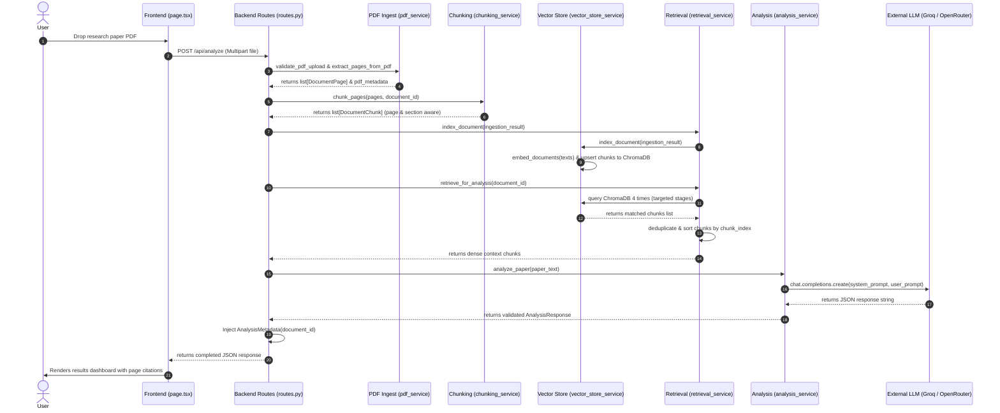

# ResearchCompass: Technical Architecture Specification (v1.0.0)

This document describes the internal architecture of ResearchCompass v1.0 and is intended for contributors and developers who want to understand or extend the system.

---

## 1. High-Level Architecture

ResearchCompass uses a decoupled **client-server** architecture. The frontend is built on **React & Next.js**, and the backend is powered by **FastAPI**. Data operations and semantic matching are managed locally using **ChromaDB** as retrieval memory.

```
+-------------------------------------------------------------------+
|                        PRESENTATION LAYER                         |
|   Next.js 15 (page.tsx, UploadSection.tsx, ResultsDashboard.tsx)  |
+---------------------------------+---------------------------------+
                                  |
                                  | HTTP REST / JSON / Multipart
                                  v
+---------------------------------+---------------------------------+
|                         ROUTING & DI LAYER                        |
|   FastAPI routes.py + dependencies.py                             |
+---------------------------------+---------------------------------+
                                  |
            +---------------------+---------------------+
            |                                           |
            v                                           v
+-----------+-----------+                   +-----------+-----------+
|     SERVICE LAYER     |                   |      PROVIDER LAYER   |
|   DocumentIngestion   |                   |                       |
|   RetrievalService    |                   |   LLMProvider         |
|   AnalysisService     |                   |   (Groq, OpenRouter,  |
|   ComparisonService   |                   |    Ollama)            |
|   LiteratureReview    |                   |                       |
|   VectorStoreService  |                   |                       |
+-----------+-----------+                   +-----------+-----------+
            |                                           |
            v                                           v
+-----------+-----------+                   +-----------+-----------+
|    LOCAL DATABASE     |                   |    EXTERNAL WORKER    |
|   ChromaDB (SQLite)   |                   |    Hosted LLM API     |
+-----------------------+                   +-----------------------+
```

---

## 2. Backend Architecture

The backend follows a strict **Service-Oriented Architecture (SOA)** with modular responsibility separation:

* **Entry Point ([app.py](backend/app.py))**: Instantiates FastAPI, configures CORS middlewares, and mounts the API router.
* **Routing ([routes.py](backend/routes.py))**: Handles HTTP verbs, validates parameters using Pydantic models, parses multipart PDF buffers, aggregates retrieval outputs, and responds in JSON format.
* **Dependency Injection ([dependencies.py](backend/dependencies.py))**: Declares factory functions decorated with `@lru_cache` to provide singleton services (such as `RetrievalService` and `LLMProvider`) to endpoints.
* **Core Services ([services/](backend/services))**: Encapsulates functional logic for parsing, embedding, storing, querying, and synthesizing reports.
* **LLM Providers ([providers/](backend/providers))**: Standardizes access to third-party language models.

---

## 3. Frontend Architecture

The frontend is an optimized Single-Page Application (SPA) utilizing React client hooks:

* **Page Component ([page.tsx](frontend/app/page.tsx))**: Manages the core workspace state (including active documents list, loaded critiques, comparisons, and progress workflow logs).
* **Upload Component ([UploadSection.tsx](frontend/components/UploadSection.tsx))**: Supports selecting multiple files, drag-and-drop actions, and filters out non-PDF files.
* **Results Panel ([ResultsDashboard.tsx](frontend/components/ResultsDashboard.tsx))**: Organizes analysis fields into responsive tabs (Overview, Deep Analysis, Critique, Next Steps) and renders publication score meters.
* **API Wrapper ([api.ts](frontend/lib/api.ts))**: Wraps raw `fetch` calls to backend endpoints, handling response parsing and throwing client-facing error objects.

---

## 4. End-to-End Request Lifecycle



---

## 5. AI Ingestion & Reasoning Pipeline

1. **PDF Text Extraction**: PyMuPDF parses PDF streams in memory, normalizing text layouts per page and extracting key headers (e.g. title, author, modification date) from metadata.
2. **Hierarchical Paragraph Chunking**: 
   * Segments raw text into paragraphs based on blank lines.
   * Tracks section headers dynamically using regex heuristics (detecting Methodology, Introduction, etc.).
   * Splits long paragraphs by sentence boundaries to enforce a maximum character threshold (default: `1800` chars), preserving an overlap window (default: `250` chars) for continuity.
   * Attaches bounding page numbers and section labels to each chunk.
3. **Semantic Indexing**: Submits text chunks to a local SentenceTransformer model (`BAAI/bge-small-en-v1.5`), generating 384-dimensional floating vectors, and saves them to ChromaDB.
4. **Targeted Retrieval (RAG)**: Queries the vector store using specialized semantic prompts (see Section 6).
5. **Grounded Prompt Assembly**: Combines the retrieved context blocks into a clean template. The prompt instructs the LLM to write thesis critiques while citing source metadata.
6. **JSON Schema Parsing & Output Validation**: Enforces `response_format={"type": "json_object"}` at the API boundary, validating the completion text against the Pydantic schema in [models.py](backend/models.py) before responding to the frontend client.

---

## 6. Retrieval Strategy (RAG)

Rather than dumping the first few pages of a document or performing a generic vector search, ResearchCompass implements a **multi-stage targeted query strategy** in [services/retrieval_service.py](backend/services/retrieval_service.py):

* **Overview Stage** (`priority: 1`, `top_k: 3`): Queries `"abstract introduction problem statement research domain"` to capture the paper's core motivation.
* **Methodology Stage** (`priority: 2`, `top_k: 3`): Queries `"methodology methods architecture training datasets evaluation metrics"` to extract model designs and architectures.
* **Evaluation Stage** (`priority: 3`, `top_k: 3`): Queries `"experiments results baselines comparison weaknesses research gaps limitations"` to audit outcomes.
* **Conclusion Stage** (`priority: 4`, `top_k: 2`): Queries `"conclusion discussion future work recommendations viva questions contributions"` to target gaps and viva questions.

### RAG Strategy Design Rationale
Using focused, multi-stage semantic queries instead of sending the entire raw PDF text is driven by critical engineering priorities:
* **Evidence Grounding**: Feeding the model short, chronologically-sorted context blocks allows it to accurately map findings to specific page numbers and section labels.
* **Mitigating "Lost in the Middle"**: Standard transformers struggle to retain information nested in the middle of long prompts. Section-based retrieval presents only highly dense, distinct contexts.
* **Context Diversity**: By explicitly querying different topics separately, we ensure we capture evidence for both methodology details and experimental limits, which might otherwise get overshadowed in a single broad query.
* **Token Efficiency**: Reduces execution latency and limits input tokens.

---

## 7. ChromaDB Storage Lifecycle

ChromaDB operates as the primary retrieval store for document embeddings:

* **Disk Persistence**: Vectors and metadata persist locally on disk within a SQLite database folder under `./chroma`.
* **Logical Isolation**:
  * For v1.0.0, all document vectors are written to a single global collection (`research_documents`).
  * Boundary protection is managed at the API query level.
  * The frontend tracks active document IDs inside its local React session state.
  * Search, comparisons, and literature reviews submit these active IDs, and `VectorStoreService` applies Chroma's `$in` operator:
    `where = {"document_id": {"$in": document_ids}}`
  * This prevents multi-user crossover, although user-isolated collections or automatic pruning are not yet implemented at the database layer.

---

## 8. Provider Abstraction Pattern

The application decouples core analysis logic from hosted LLM details using the **Provider Abstraction Pattern**:

* **Base Class ([providers/base.py](backend/providers/base.py))**: Defines `LLMProvider` abstract interface.
* **Implementations**:
  * `GroqProvider`: Uses `groq` client library, supports native JSON completion modes. Groq is the default, primary provider for v1.0.0 due to low latency.
  * `OpenRouterProvider`: Fully implemented, configurable via environment switches.
  * `OllamaProvider`: For local inference servers.
* **Automatic Fallback**: Out of scope for v1.0.0; fallback routing is planned for a future release.

---

## 9. Dependency Injection (DI)

FastAPI routes obtain service instances using `Depends` injections in [dependencies.py](backend/dependencies.py). Singletons are cached in memory using Python's standard `functools.lru_cache`:

```python
@lru_cache
def get_vector_store_service() -> VectorStoreService:
    return VectorStoreService(
        embedding_service=get_embedding_service(),
        persist_directory=settings.chroma_persist_directory,
        collection_name=settings.chroma_collection_name,
    )
```
This decoupling simplifies testing: unit tests can inject fake vector stores or mock embedding modules without modifying routes or endpoint logic.

---

## 10. Multi-Document Workspaces & Session Flow

ResearchCompass manages multi-document workspaces on the client side using active React states:

1. **Transient Registry**:
   * The home page uploader accepts list arrays: `files: File[]`.
   * For each uploaded file, the client invokes `analyzeResearchPaper` and registers the analyzed results:
     `papers: Array<{ name: string, result: AnalysisResult }>`
2. **Contextual Actions**:
   * If `papers.length > 1`, comparative controls appear below the dashboards.
   * **Compare Papers** calls `POST /api/compare` with active `document_ids`.
   * **Literature Review** calls `POST /api/literature-review` with active `document_ids`.
   * Comparative outputs are returned and rendered inline on the same page. The session ends when the browser tab is closed.

---

## 11. Folder Responsibilities

* **`backend/providers/`**: decodes configuration parameters and returns LLM interface wrappers.
* **`backend/services/pdf_service.py`**: Validates PDF file sizes, page limits, checks encryption/passwords, and parses text layout structures.
* **`backend/services/chunking_service.py`**: Scans paragraphs for section boundaries and generates overlapping, page-aware text chunks.
* **`backend/services/embedding_service.py`**: Interfaces with `SentenceTransformers` to generate dense vectors.
* **`backend/services/vector_store_service.py`**: Manages local SQLite files, creates collections, and queries vectors using metadata filters.
* **`backend/services/retrieval_service.py`**: Manages the multi-stage targeted query plan and aggregates RAG context.
* **`backend/services/analysis_service.py`**: Prompts models and parses structural critique outputs.
* **`backend/services/comparison_service.py`**: Builds comparative RAG tables and generates overlaps analysis.
* **`backend/services/literature_review_service.py`**: Synthesizes thematic developments and generates cohesive review literature.

---

## 12. Extension Points

### Adding a New LLM Provider
1. Create a class inside `backend/providers/` implementing the `LLMProvider` interface.
2. Register the provider name in `SUPPORTED_PROVIDERS` inside [config.py](backend/config.py).
3. Update the switch case inside the provider factory [providers/factory.py](backend/providers/factory.py) to instantiate your class.

### Modifying the RAG Retrieval Strategy
1. Adjust the `DEFAULT_RETRIEVAL_STRATEGY` dictionary array inside [services/retrieval_service.py](backend/services/retrieval_service.py).
2. You can add more retrieval stages (e.g. searching for specific implementation details), adjust individual `top_k` values, or rearrange priorities.

### Expanding the Critique JSON Schema
1. Add fields to `AnalysisResponse` inside [models.py](backend/models.py).
2. Update the target output JSON template inside `SYSTEM_PROMPT` in [services/analysis_service.py](backend/services/analysis_service.py).
3. The Pydantic model will automatically validate and parse the new fields before sending them to the client interface.
