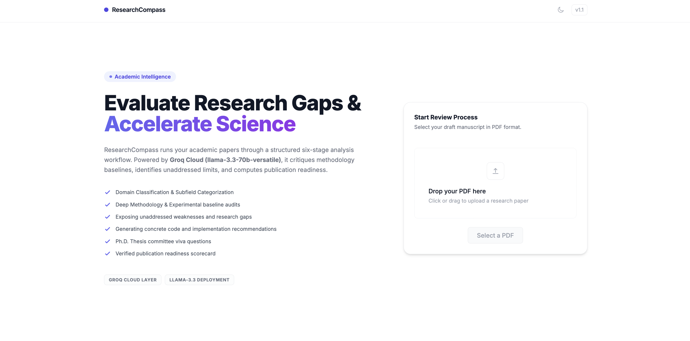
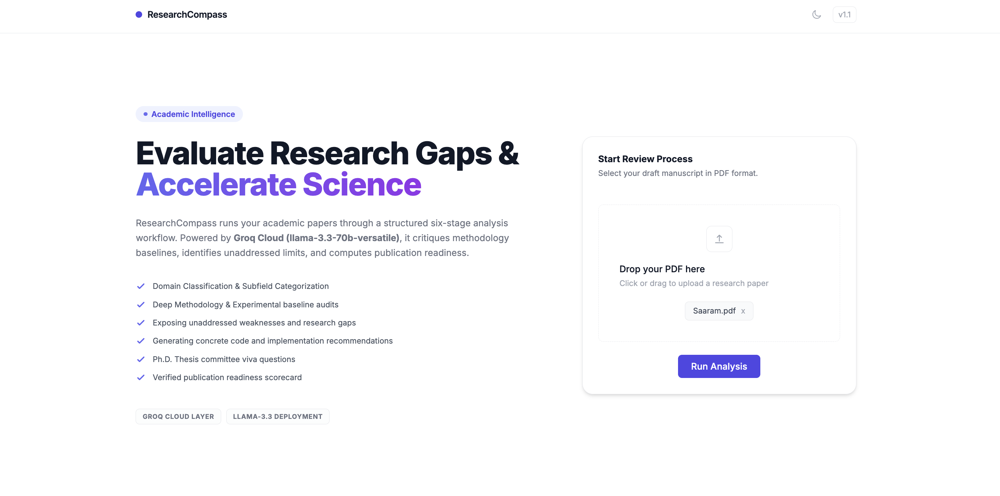
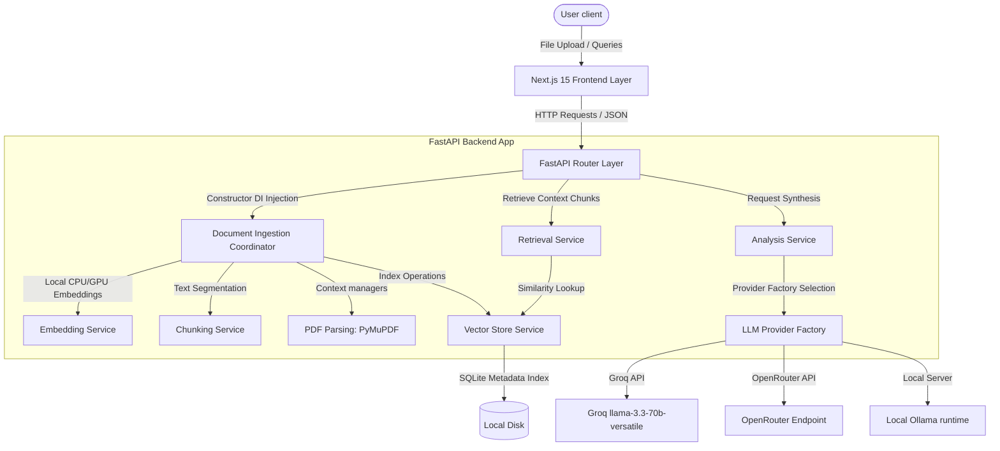

# ResearchCompass

A local document analysis tool that parses scientific papers, stores them in a vector database, and generates structured reviews.

[](https://fastapi.tiangolo.com)
[](https://nextjs.org)
[](https://www.trychroma.com)
[](https://groq.com)
[](LICENSE)

## Interface Overview & E2E Workflow

The application workflow is divided into three key stages: Ingestion, Processing, and Review Analysis.

### 1. Landing & Manuscript Dropzone
Users land on a clean, dual-column screen where they can drag and drop draft papers in PDF format.


### 2. Manuscript Selection & Loading
Once a file is selected, the "Run Analysis" controller triggers the ingestion pipeline.


### 3. Live Ingestion Monitor
Processing triggers real-time pipeline status logs detailing extraction, chunking, and embedding stages.


### 4. Structured Review Dashboard
Once completed, the dashboard presents a structured analysis categorized into metadata insights, methodology audits, thesis viva defense questions, and a publication readiness score.


---

## What is ResearchCompass?

ResearchCompass is a self-hosted tool that helps researchers evaluate academic manuscripts. It extracts text from uploaded PDFs, segments the pages, indexes them in a local ChromaDB instance, and prompts Large Language Models (LLMs) to generate methodology audits, gap discovery reports, and thesis defense questions.

---

## Why ResearchCompass?

Researchers face an overwhelming volume of papers, and standard PDF readers do not highlights gaps or methodological limits. ResearchCompass solves this by automatically parsing double-column layouts, indexing document segments semantically, and running them through a structured critique template. This exposes constraints, extracts core baselines, and suggests concrete code-level improvements before peer review or thesis defense.

---

## Features

### Core Features
*   **Structured PDF Parsing:** Extracts clean sequential text blocks from multi-column scientific layouts using PyMuPDF.
*   **Ingestion Guardrails:** Restricts uploads to PDF files under 20MB and 200 pages to protect memory buffers.
*   **Metadata Extraction:** Groups and displays documents by author, publishing year, and CS subfield domains.

### AI Features
*   **Methodology Audits:** Analyzes baseline datasets, models, training procedures, and experimental settings.
*   **Gaps & Weaknesses Detection:** Exposes unaddressed limits, sample size issues, and conceptual trade-offs.
*   **Thesis Defense Preparation:** Generates 5 defense-level questions a review committee would ask about the paper.
*   **Semantic Search & RAG:** Queries local document context using cosine similarity vectors before running LLM prompts to prevent hallucinations.

### Engineering Features
*   **Local Vector Indexing:** Stores document chunks and metadata persistently inside a local SQLite-backed ChromaDB collection.
*   **LLM Provider Abstraction:** Implements a strategy pattern supporting switches between Groq, OpenRouter, and local Ollama runtimes.
*   **Zero Framework Bloat:** Executes text chunking, embedding generation, and prompt assembly natively in standard Python without LangChain or LlamaIndex.
*   **Isolated Testing:** Includes 49 unit and integration tests running against local in-memory databases with mocked network endpoints.

---

## Technology Stack

| Component | Technology | Role / Purpose |
| :--- | :--- | :--- |
| **Frontend** | Next.js 15 (React, TypeScript) | Layout organization, file upload triggers, terminal-style loader, results view |
| **Backend** | Python (FastAPI, Uvicorn) | REST API routes, custom exception handlers, constructor dependency injection |
| **Vector Index** | ChromaDB | Local SQL-backed persistent vector database |
| **Embeddings** | SentenceTransformers | Local `BAAI/bge-small-en-v1.5` embeddings running on CPU/GPU |
| **LLM Provider** | Groq, OpenRouter, Ollama | Completion engine running Llama-3.3-70b |
| **Testing** | PyTest, PyTest-Asyncio | Automated mock-isolated test suites |

---

## Project Structure

*   `backend/app.py`: FastAPI application bootstrapping, CORS middleware mounting, and route registration.
*   `backend/routes.py`: API endpoints for document ingestion, semantic search, and structured reviews.
*   `backend/config.py`: Global environment settings configuration utilizing Pydantic `BaseSettings`.
*   `backend/dependencies.py`: Dependency injection container providing cached singleton services.
*   `backend/models.py`: Pydantic input/output serialization contracts.
*   `backend/providers/`: Vendor wrappers implementing the `LLMProvider` abstract strategy contract.
*   `backend/services/`: Moduler services managing PDF parsing, chunking, embeddings, vector writes, and critiques.
*   `frontend/app/`: Next.js page state router managing the split-landing layout.
*   `frontend/components/`: Modular React components for upload dropzones, terminal workflow monitors, and results cards.

---

## System Architecture

ResearchCompass is structured into decoupled layers, separating presentation logic from orchestration services and database management.



### Layer Responsibilities
*   **FastAPI Router Layer (`routes.py`):** Acts as the entry gate, handling serialization, validating input objects, and converting domain exceptions to unified HTTP codes.
*   **Service Layer (`services/`):** Coordinates pipeline execution. For example, `DocumentIngestionService` coordinates reading the file, chunking it, creating embeddings, and writing to ChromaDB.
*   **Provider Layer (`providers/`):** Implements vendor-specific request layouts (Groq API, OpenRouter, Ollama) behind a single unified interface.

---

## AI Ingestion & Retrieval Pipeline

When a manuscript is uploaded, it runs through the following pipeline:

```text
[ Upload PDF ]
      │
      ▼
[ Parse Pages ] ────► Extracts layout text using PyMuPDF (fitz)
      │
      ▼
[ Segment Text ] ───► Chunks text into segments with overlapping word boundaries
      │
      ▼
[ Embed Chunks ] ───► Generates vector representations using BGE-small-en-v1.5
      │
      ▼
[ Store Index ] ────► Persists embeddings & metadata (document title, author) to ChromaDB
      │
      ▼
[ Query Retrieval] ─► Performs similarity searches to gather context for questions
      │
      ▼
[ LLM Generation ] ─► Prompts llama-3.3-70b-versatile with retrieved context blocks
      │
      ▼
[ Return JSON ] ────► Validates response structures and serves structured data to client
```

---

## Local Setup

### Prerequisites
*   Python 3.10 or 3.11
*   Node.js 18+

### 1. Backend Configuration
Navigate to the backend directory, create a virtual environment, and install dependencies:
```bash
cd backend
python3.11 -m venv venv
source venv/bin/activate
pip install -r requirements.txt
```

Create a `.env` file copying the environment template:
```bash
cp .env.example .env
```

Open the `.env` file and insert your Groq API key:
```env
GROQ_API_KEY=gsk_your_actual_key_here
LLM_PROVIDER=groq
```

Start the FastAPI application:
```bash
uvicorn app:app --reload --port 8000
```

### 2. Frontend Configuration
Navigate to the frontend directory and install dependencies:
```bash
cd ../frontend
npm install
```

Start the development server:
```bash
npm run dev
```

Open [http://localhost:3000](http://localhost:3000) in your web browser.

---

## API Reference

### `POST /api/analyze`
*   **Purpose:** Ingests and parses a PDF, indexes its chunks, retrieves context segments, calls the critique prompt, and returns the review payload.
*   **Request Format:** `multipart/form-data` with `file: UploadFile`.
*   **Response Format:** `AnalysisResponse` JSON object containing `research_domain`, `executive_summary`, `methodology`, `viva_questions`, and `publication_readiness_score`.

### `POST /api/search`
*   **Purpose:** Vector similarity search across all indexed chunks in ChromaDB.
*   **Request Format:** JSON `SemanticSearchRequest` with fields `query` (string) and `top_k` (integer).
*   **Response Format:** `SemanticSearchResponse` containing a list of `SemanticSearchResult` objects with scores and raw context strings.

### `GET /api/documents`
*   **Purpose:** Lists all parsed manuscripts currently indexed in ChromaDB.
*   **Response Format:** `list[LibraryDocument]` JSON array.

---

## Engineering Decisions

*   **FastAPI & Pydantic:** Selected over Flask or Django for async request loops and automatic OpenAPI schema validation. Pydantic handles type-safe request/response parsing natively.
*   **ChromaDB Vector Store:** Used because it is a lightweight, local, SQLite-backed vector database, which avoids the need for external cluster setups.
*   **Shared Constructor Dependency Injection:** Implemented in `dependencies.py` to coordinate singletons and resolve services at startup. This enables clean unit-test mocking and prevents reload overheads of the local SentenceTransformer models.
*   **Native RAG Implementation (No LangChain/LlamaIndex):** Built in pure Python to eliminate third-party framework abstraction layers, optimize pipeline execution speeds, and maintain full control over the contextual prompt templates.
*   **LLM Provider Strategy Pattern:** Decouples model calls from routing endpoints, allowing switches between local Ollama instances and cloud APIs without altering downstream code.

---

## Future Work

*   **Asynchronous Processing:** Move PDF parsing and index tasks to background workers (e.g., Celery/Redis) to prevent long-running tasks from blocking the web threads.
*   **Token Response Streaming:** Support HTTP streaming chunks to lower user time-to-first-token latency.
*   **Interactive Citations:** Link extracted snippets in the dashboard back to page coordinates inside the PDF viewer.

---

## Contributing
Contributions are welcome. Please open an issue to discuss proposed changes before submitting a pull request.

---

## License
Distributed under the MIT License. See `LICENSE` for details.
