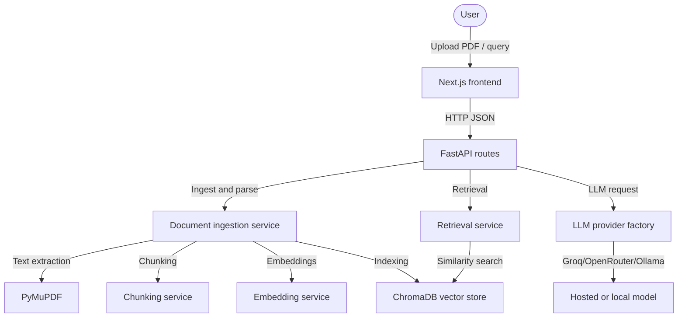

# ResearchCompass

ResearchCompass is a local web app for reviewing scientific PDFs. It extracts text from uploaded papers, builds a local vector index, and uses an LLM to produce structured review output for methodology, strengths, weaknesses, and follow-up questions.

[](https://fastapi.tiangolo.com)
[](https://nextjs.org)
[](https://www.trychroma.com)
[](https://groq.com)
[](LICENSE)

## Interface Overview

The app flow is straightforward: upload a PDF, process the document, index the content, and review the generated analysis.

### 1. Landing screen
Users can upload a PDF from the main page.


### 2. Upload and analysis trigger
The selected file is sent to the backend for ingestion and analysis.


### 3. Processing view
The app shows the ingestion and retrieval pipeline stages while the document is being processed.


### 4. Results dashboard
The final view summarizes methodology notes, weaknesses, gaps, and readiness feedback.


## Quick Demo

```text
Upload PDF
    ↓
Extract
    ↓
Embed
    ↓
Retrieve
    ↓
Analyze
    ↓
Results
```

---

## What ResearchCompass does

The project combines a FastAPI backend, a Next.js frontend, and a local ChromaDB vector store. It is intended for researchers who want a structured review of a paper before they share it or prepare for a discussion.

## Features

### Core workflow
- PDF upload and validation
- Text extraction from scientific papers
- Chunking and indexing for retrieval
- Structured critique generation

### Included outputs
- Methodology review
- Strengths and weaknesses
- Research gaps and novelty assessment
- Viva-style questions
- Publication readiness score

### Engineering details
- Local vector indexing with ChromaDB
- LLM provider abstraction for Groq, OpenRouter, or Ollama
- FastAPI routes with Pydantic response validation
- Pytest coverage for the backend services

---

## Technology Stack

| Component | Technology | Role |
| :--- | :--- | :--- |
| Frontend | Next.js 15 + React + TypeScript | App shell, upload flow, results UI |
| Backend | Python + FastAPI | API routes, request handling, analysis orchestration |
| Vector store | ChromaDB | Local document chunk indexing |
| Embeddings | SentenceTransformers | Local embedding generation |
| LLM providers | Groq, OpenRouter, Ollama | Completion generation |
| Testing | Pytest + Pytest-Asyncio | Backend test coverage |

---

## Project structure

- backend/app.py: FastAPI application setup and middleware
- backend/routes.py: API endpoints for analyze, ingest, compare, literature review, and semantic search
- backend/config.py: Environment-based configuration
- backend/dependencies.py: Service wiring for the app
- backend/models.py: Pydantic request and response models
- backend/providers/: Provider implementations for supported LLM backends
- backend/services/: PDF parsing, chunking, embedding, retrieval, and analysis services
- frontend/app/: Next.js page-level state and workspace routing
- frontend/components/: UI components for upload, workflow, and results views

---

## System architecture



---

## AI pipeline

```text
Upload PDF
  ↓
Parse pages
  ↓
Chunk text
  ↓
Generate embeddings
  ↓
Index chunks in ChromaDB
  ↓
Retrieve relevant context
  ↓
Generate structured review output
```

---

## Local setup

### Prerequisites
- Python 3.10 or 3.11
- Node.js 18+

### Backend
```bash
cd backend
python3.11 -m venv venv
source venv/bin/activate
pip install -r requirements.txt
cp .env.example .env
```

Edit backend/.env and set values such as:
```env
GROQ_API_KEY=your_groq_api_key_here
LLM_PROVIDER=groq
```

Start the API:
```bash
uvicorn app:app --reload --port 8000
```

### Frontend
```bash
cd ../frontend
npm install
npm run dev
```

Open http://localhost:3000 in your browser.

---

## API reference

### POST /api/analyze
- Purpose: ingests a PDF, indexes its content, retrieves context, and returns a structured analysis response.
- Request: multipart/form-data with a PDF file.
- Response: JSON matching the analysis schema.

Example response:
```json
{
  "research_domain": "Computer Science",
  "executive_summary": "The paper presents a compact transformer architecture for low-resource settings.",
  "problem_statement": "The study addresses efficient long-context inference under constrained compute budgets.",
  "methodology": "The authors compare several pruning strategies and evaluate them on standard benchmarks.",
  "key_contributions": ["A smaller transformer variant", "A pruning-based training recipe"],
  "strengths": ["Clear evaluation setup", "Practical engineering focus"],
  "weaknesses": ["Limited ablation coverage", "No baseline on larger models"],
  "research_gaps": ["Few results on multilingual transfer"],
  "novelty_assessment": "The approach is incremental but practically useful.",
  "implementation_improvements": ["Add more ablation studies", "Report inference latency"],
  "future_work": ["Test on larger corpora", "Evaluate energy efficiency"],
  "viva_questions": ["How does pruning affect robustness?"],
  "publication_readiness_score": 74,
  "publication_readiness_justification": "The work is promising but would benefit from stronger ablations and broader evaluation."
}
```

### POST /api/search
- Purpose: vector similarity search over indexed chunks.
- Request: JSON with query and top_k.

### GET /api/documents
- Purpose: returns the currently indexed documents.

---

## Engineering decisions

- FastAPI and Pydantic provide type-safe request and response handling.
- ChromaDB keeps the local vector store lightweight and easy to run without a separate service.
- Dependency injection keeps service construction consistent for tests and local development.
- The backend uses a provider abstraction so Groq, OpenRouter, and Ollama can be swapped without changing the rest of the pipeline.

---

## Future work

- Add background processing for large uploads.
- Add richer citation and evidence linking in the UI.
- Add more automated evaluation for generated reviews.

---

## Contributing

Contributions are welcome. Please open an issue before proposing larger changes.

---

## License

Distributed under the MIT License. See [LICENSE](LICENSE) for details.
