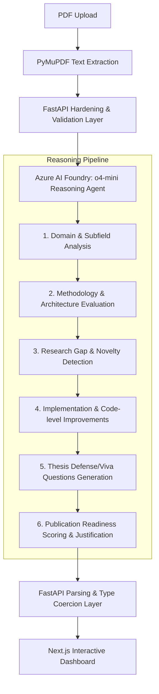

# ResearchCompass


ResearchCompass is an AI-powered research reasoning agent built for evaluating academic papers, submitted as part of the **Microsoft Agents League Hackathon**. It extracts text from uploaded PDFs, runs the content through a structured review reasoning workflow powered by Microsoft Azure AI Foundry, and returns a high-fidelity dashboard detailing research methodology, gaps, code-level improvements, thesis defense questions, and publication readiness.

Unlike basic search or summarization tools, ResearchCompass acts as an autonomous research advisor—evaluating paper structure, finding unaddressed limitations, and offering concrete architectural improvements.

---

## 🤖 Reasoning Agent Workflow & Architecture

ResearchCompass leverages the advanced reasoning capabilities of **OpenAI's o4-mini** deployment via **Microsoft Azure AI Foundry** to perform deep, multi-step critique. The agentic workflow runs through the following sequence:



1. **Extraction**: PyMuPDF parses the PDF uploaded from the Next.js frontend, extracting text and metadata.
2. **Hardening**: The FastAPI backend isolates environment lookup, wraps file processing in context managers to prevent leaks, and regulates LLM calls.
3. **Reasoning Agent**: Azure AI Foundry o4-mini executes an inline chain-of-thought review, examining the paper's claims, baselines, code reproducibility, and methodology.
4. **Resilient Parsing**: A custom parsing layer extracts nested JSON blocks, maps camelCase or alternative LLM-produced keys, normalizes list-field formats, and auto-corrects rating scale discrepancies (e.g. converting 1-10 scores to 0-100 scales).
5. **Interactive Render**: The Next.js dashboard visualizes the review with a custom agent workflow timeline, color-coded strengths/weaknesses cards, and an interactive publication score.

---

## Tech Stack

| Layer | Technology |
| --- | --- |
| **Frontend** | Next.js 15, React, TypeScript, Tailwind CSS |
| **Backend** | FastAPI, Python, Pydantic, PyMuPDF |
| **AI Layer** | Azure AI Foundry (o4-mini deployment) |

---

## Quick Start

### Backend Setup

1. Navigate to the backend directory:
   ```bash
   cd backend
   ```
2. Set up virtual environment and install dependencies:
   ```bash
   python -m venv venv
   source venv/bin/activate  # Windows: venv\Scripts\activate
   pip install -r requirements.txt
   ```
3. Copy the environment variables:
   ```bash
   cp .env.example .env
   ```
4. Update `.env` with your Azure credentials:
   ```env
   AZURE_OPENAI_ENDPOINT=https://your-resource-name.services.ai.azure.com/openai/v1/
   AZURE_OPENAI_API_KEY=your_azure_openai_api_key_here
   AZURE_OPENAI_DEPLOYMENT=o4-mini
   ```
5. Start the FastAPI server:
   ```bash
   uvicorn app:app --reload --port 8000
   ```

### Frontend Setup

1. Navigate to the frontend directory:
   ```bash
   cd frontend
   ```
2. Install dependencies:
   ```bash
   npm install
   ```
3. Copy environment configuration:
   ```bash
   cp .env.example .env
   ```
4. Start the Next.js application:
   ```bash
   npm run dev
   ```

Open [http://localhost:3000](http://localhost:3000) to upload papers and trace the agent workflow.

---

## API Reference

### `POST /api/analyze`
* **Request**: `multipart/form-data` with `file` field containing a PDF.
* **Response**: A verified `AnalysisResponse` JSON schema with all evaluation fields, strictly typed and validated by Pydantic.

---

## Security Notes

* Environment files (`.env`) are strictly ignored via `.gitignore` to prevent secret leakage.
* System components dynamically validate required keys at startup to avoid runtime exceptions.
* PyMuPDF file handles are wrapped in context managers to eliminate memory and file-descriptor leaks.

---

## License

MIT
