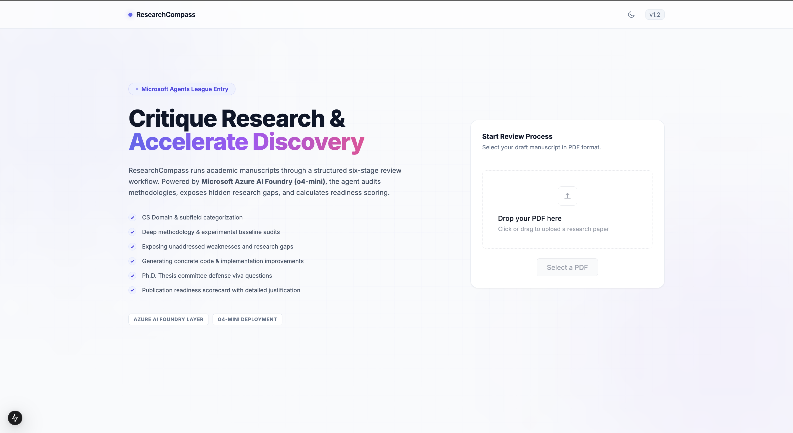
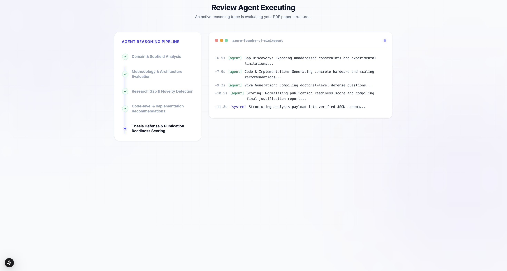
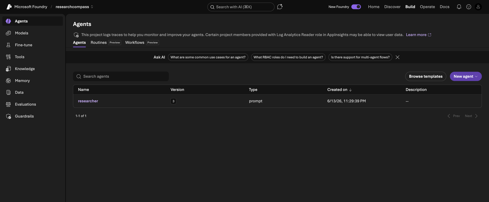
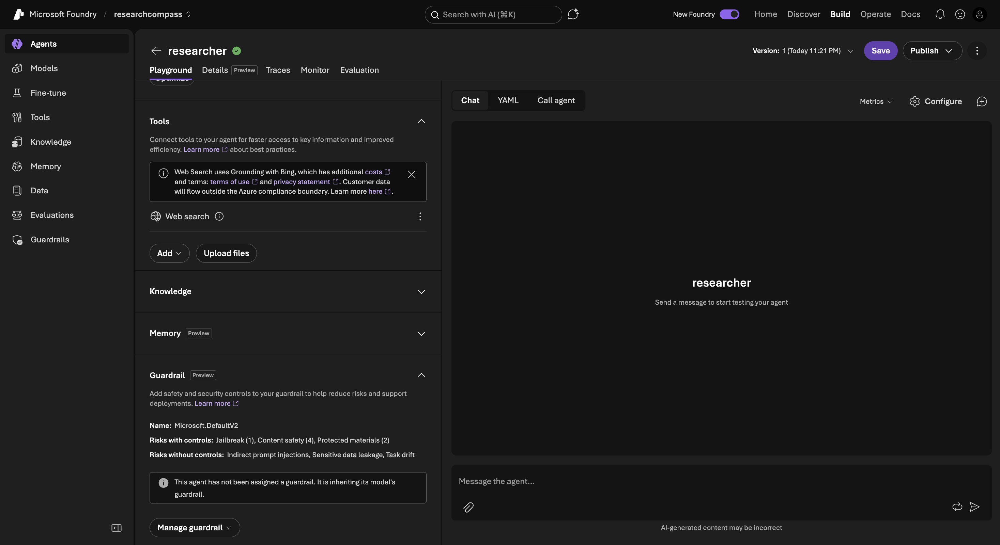
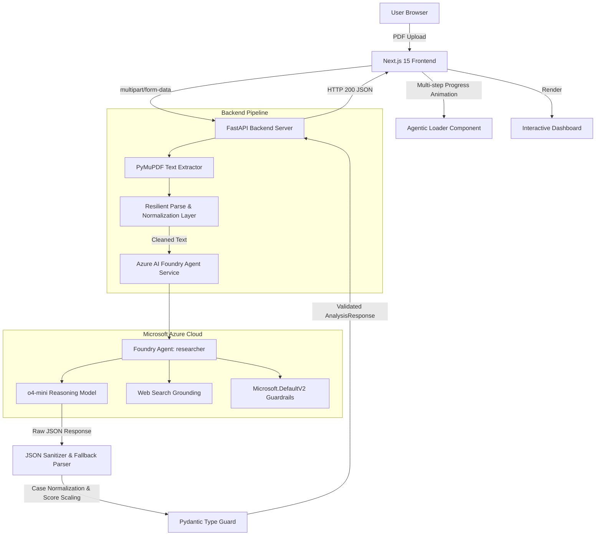

# ResearchCompass

> **An agentic research review system evaluating academic papers and detecting gaps using Microsoft Azure AI Foundry.**

---

[](https://fastapi.tiangolo.com)
[](https://nextjs.org)
[](https://azure.microsoft.com/en-us/products/ai-foundry)
[](LICENSE)

---

## 📌 Elevator Pitch

ResearchCompass is an agentic research review system that critiques academic research papers, identifies hidden methodology flaws and research gaps, and scores publication readiness — powered by a **Microsoft Foundry Agent** deployed in Azure AI Foundry.

---

## ⚡ Problem Statement

Academic peer review is a high-friction process: it is slow, often subjective, and inaccessible to students before submission. Researchers frequently struggle to:

- Identify unaddressed limitations and methodology holes in their own draft papers.
- Benchmark their contributions against existing baselines.
- Generate tough thesis/viva questions to prepare for defense.
- Objectively gauge if their work is ready for publication in top-tier conferences or journals.

---

## 💡 Solution Overview

ResearchCompass acts as a self-hosted **AI-powered research review assistant**. Rather than performing simple document summarization, the system conducts a critical peer review.

By extracting text from uploaded PDFs and routing requests through a **Microsoft Foundry Agent** ("researcher") backed by o4-mini, the assistant delivers a comprehensive evaluation dashboard — including concrete code-level improvements, detailed gap detections, viva defense questions, and a normalized publication readiness score.

---

## 🖼️ Application Interface

### Landing Page


### Agent Reasoning Pipeline


### Analysis Dashboard


---

## 🤖 Microsoft Foundry Agent

### Foundry Agent Setup


### Foundry Agent Configuration


ResearchCompass is powered by a **Microsoft Foundry Agent** named "researcher" (Version 3, deployed 6/13/26) within the `researchcompass` Foundry project:

| Property | Value |
| :--- | :--- |
| Agent Name | researcher |
| Model | o4-mini (Global Standard) |
| Tools | Web Search (Bing grounding) |
| Guardrails | Microsoft.DefaultV2 |
| Safety Controls | Jailbreak (1), Content Safety (4), Protected Materials (2) |
| Project | researchcompass |
| Platform | Microsoft Azure AI Foundry |

The Foundry Agent serves as the cognitive backbone of ResearchCompass — receiving structured paper analysis prompts, applying safety guardrails, and returning grounded structured JSON responses through the Foundry Agent Service endpoint.

---

## 🛠️ Architecture Overview



### Data Flow

1. **Extraction Layer**: PyMuPDF (`fitz`) opens the PDF stream inside a memory-safe context manager, extracting structured text.
2. **Foundry Agent**: The FastAPI server routes requests to the Microsoft Foundry Agent ("researcher") which applies safety guardrails and web search grounding before invoking o4-mini.
3. **Resilient Parsing**: A custom parsing layer cleans markdown block formats, normalizes camelCase/dashed fields, and scales 1-10 scores to 0-100%.
4. **Pydantic Validation**: Ensures response payloads conform strictly to the TypeScript type contract before returning data to the UI.

---

## 🔬 Agentic Workflow

During computation, the **Foundry Agent** executes a **structured six-stage analysis workflow**:

| Step | Phase | Focus |
| :--- | :--- | :--- |
| `1` | **Domain Analysis** | Identifies the precise research domain and subfield categorization. |
| `2` | **Methodology Review** | Critiques models, datasets, baseline comparison accuracy, and metrics. |
| `3` | **Research Gap Detection** | Finds what was omitted, oversimplified, or ignored in the paper. |
| `4` | **Improvement Recommendations** | Suggests concrete, actionable code-level edits and parameter scaling. |
| `5` | **Viva Questions** | Generates 5 defense questions typical of a PhD thesis committee. |
| `6` | **Publication Evaluation** | Computes a readiness score from 0-100 and outlines justifying reasoning. |

### Visual Pipeline Loading

While the Foundry Agent processes the paper, the frontend displays a real-time progress timeline:
[✓] Domain & Subfield Analysis

[✓] Methodology & Architecture Evaluation

[●] Research Gap & Novelty Detection  <-- Active Pulsing Indicator

[ ] Code-level & Implementation Recommendations

[ ] Thesis Defense & Publication Readiness Scoring

---

## 🚀 Microsoft Agents League Integration

### Microsoft Azure AI Foundry (Foundry IQ)

ResearchCompass integrates **Microsoft Azure AI Foundry** as its foundational intelligence layer:

- **Foundry Agent Service**: The "researcher" agent is deployed and managed through Microsoft Foundry Agent Service, providing versioned, monitored, and traceable agent execution.
- **Web Search Grounding**: The Foundry Agent uses Bing-backed web search to ground responses in current research context.
- **Microsoft.DefaultV2 Guardrails**: Enterprise-grade safety controls including jailbreak protection, content safety (4 controls), and protected materials detection (2 controls) are applied to every request.
- **Traces & Evaluation**: Foundry provides built-in traces, monitoring, and evaluation tabs for agent observability.

### GitHub Copilot Usage

This project was built and hardened with the assistance of **GitHub Copilot** alongside Antigravity:

- **FastAPI Route Generation**: Copilot assisted in generating async file upload configurations, CORS middleware definitions, and error propagation wrappers in `routes.py` and `app.py`.
- **Next.js UI Development**: Copilot accelerated Tailwind grid layouts, theme toggling scripts, glassmorphic card styling in `ResultsDashboard.tsx`, and drag-and-drop React hooks in `UploadSection.tsx`.
- **Azure AI Foundry Integration**: Copilot generated Python client configurations and correct OpenAI client base URL setups targeting the Azure AI Foundry endpoint in `foundry_service.py`.
- **Score Normalization & Debugging**: Copilot facilitated writing the regex-based digit extractor (`coerce_to_int`) and type-coercion routines (`coerce_to_string_list`), and assisted writing assertions in `test_validation.py` to identify scale mismatches.

---

## 📦 Technology Stack

| Layer | Technology |
| :--- | :--- |
| Frontend | Next.js 15, React 18, TypeScript, Tailwind CSS |
| Backend | FastAPI, Python 3.11, PyMuPDF, Pydantic v2 |
| AI Agent | Microsoft Foundry Agent (researcher) |
| AI Model | Azure AI Foundry o4-mini |
| Safety | Microsoft.DefaultV2 Guardrails |
| Dev Tools | GitHub Copilot, Antigravity |

---

## ⚙️ Environment Variables

### Backend (`backend/.env`)

```env
AZURE_OPENAI_ENDPOINT=https://<your-resource-name>.services.ai.azure.com/openai/v1/
AZURE_OPENAI_API_KEY=your_azure_openai_api_key_here
AZURE_OPENAI_DEPLOYMENT=o4-mini
```

### Frontend (`frontend/.env`)

```env
NEXT_PUBLIC_API_URL=http://localhost:8000
```

---

## 🚀 Installation & Setup

### Backend

Ensure Python 3.11+ is installed.

```bash
cd backend
python -m venv venv
source venv/bin/activate  # Windows: venv\Scripts\activate
pip install -r requirements.txt
cp .env.example .env
# Edit backend/.env with your Azure AI Foundry credentials
uvicorn app:app --reload --port 8000
```

### Frontend

Ensure Node.js 18+ and npm are installed.

```bash
cd frontend
npm install
cp .env.example .env
npm run dev
```

Open `http://localhost:3000`.

---

## 📁 Project Structure
ResearchCompass/

├── backend/

│   ├── services/

│   │   ├── foundry_service.py    # Azure AI Foundry Agent integration

│   │   └── pdf_service.py        # PyMuPDF text extraction

│   ├── app.py                    # FastAPI app + CORS

│   ├── routes.py                 # API endpoints

│   ├── models.py                 # Pydantic response models

│   └── requirements.txt

├── frontend/

│   ├── app/                      # Next.js 15 app router

│   ├── components/               # UI components

│   └── lib/                      # API client

├── docs/

│   └── screenshots/              # Application + Foundry screenshots

└── README.md

---

## 🔮 Future Roadmap

- **Foundry IQ Knowledge Base**: Connect Azure AI Search to ground gap detection in curated research literature.
- **FAISS Vector Indexing**: Retrieve and embed abstracts from arXiv to detect gaps against active prior art.
- **Crossref Citation Graphing**: Extract references, match DOIs, and build a citation network to identify missing seminal papers.
- **Batch Paper Comparison**: Upload multiple PDFs to align methodologies and datasets across comparable papers.
- **Multi-Agent Workflow**: Dedicated Planner, Executor, and Critic agents orchestrated through Foundry Workflows.

---

## 📄 License

This project is licensed under the MIT License. See [LICENSE](LICENSE) for details.