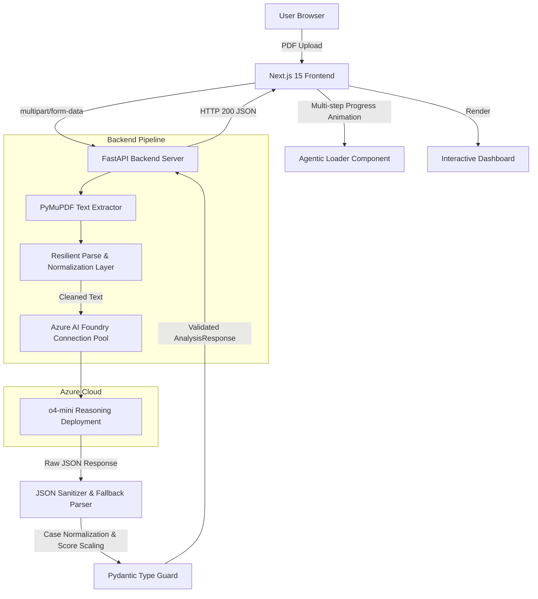

# ResearchCompass

> **An agentic research review system evaluating academic papers and detecting gaps using Microsoft Azure AI Foundry.**

---

[](https://fastapi.tiangolo.com)
[](https://nextjs.org)
[](https://azure.microsoft.com/en-us/products/ai-foundry)
[](LICENSE)

---

## 📌 Elevator Pitch
ResearchCompass is an agentic research review system that critiques academic research papers, identifies hidden methodology flaws and research gaps, and scores publication readiness—powered by the advanced reasoning layers of Microsoft Azure AI Foundry.

---

## ⚡ Problem Statement
Academic peer review is a high-friction process: it is slow, often subjective, and inaccessible to students before submission. Researchers frequently struggle to:
- Identify unaddressed limitations and methodology holes in their own draft papers.
- Benchmark their contributions against existing baselines.
- Generate tough thesis/viva questions to prepare for defense.
- Objectively gauge if their work is ready for publication in top-tier conferences or journals.

---

## 💡 Solution Overview
ResearchCompass acts as a self-hosted **AI-powered research review assistant**. Rather than performing simple document summarization, the system conducts a critical peer review. 

By extracting text from uploaded PDFs and feeding it into a multi-step reasoning pipeline hosted on **Microsoft Azure AI Foundry (o4-mini)**, the assistant delivers a comprehensive evaluation dashboard. This includes concrete code-level improvements, detailed gap detections, viva defense questions, and a normalized publication readiness score.

---

## 🛠️ Architecture Overview
ResearchCompass is designed with a decoupled frontend-backend architecture structured to maximize response resiliency and safety:



### Data Flow
1. **Extraction Layer**: PyMuPDF (`fitz`) opens the PDF stream inside a memory-safe context manager, extracting structured text.
2. **Reasoning Engine**: The FastAPI server routes requests to a connection-pooled **OpenAI client** pointing directly to the **Azure AI Foundry** endpoint.
3. **Resilient Parsing**: A custom parsing layer cleans markdown block formats (````json ... ````), normalizes camelCase/dashed fields, and normalizes rating scales (scaling 1-10 scores to 0-100%).
4. **Pydantic Validation**: Ensures response payloads conform strictly to the typescript type contract before returning data to the UI.

---

## 🤖 Agentic Workflow
During computation, the **o4-mini reasoning model** executes a **structured six-stage analysis workflow**:

| Step | Phase | Focus |
| :--- | :--- | :--- |
| `1` | **Domain Analysis** | Identifies the precise computer science domain and subfield categorization. |
| `2` | **Methodology Review** | Critiques models, datasets, baseline comparison accuracy, and metrics. |
| `3` | **Research Gap Detection** | Finds what was omitted, oversimplified, or ignored in the paper. |
| `4` | **Improvement Recommendations** | Suggests concrete, actionable code-level edits and parameter scaling. |
| `5` | **Viva Questions** | Generates 5 defense questions typical of a PhD thesis committee. |
| `6` | **Publication Evaluation** | Computes a readiness score from 0-100 and outlines justifying reasoning. |

---

## 🎨 User Experience & Demo Quality
ResearchCompass features a modern **glassmorphic design system** supporting complete Dark/Light modes. 

### Visual Pipeline Loading
While the LLM processes the paper, the frontend displays a real-time progress timeline of the agent's analysis workflow, preventing the application from feeling static:

```text
  [✓] Domain & Subfield Analysis
  [✓] Methodology & Architecture Evaluation
  [●] Research Gap & Novelty Detection  <-- (Active Pulsing Indicator)
  [ ] Code-level & Implementation Recommendations
  [ ] Thesis Defense & Publication Readiness Scoring
```

---

## 🖼️ Application Interface (Screenshots & Mockups)

*Below are descriptions of the high-fidelity user interface panels of ResearchCompass:*

### 1. File Upload Dropzone
- **Layout**: A clean drag-and-drop area supporting PDF uploads, showing filename badges on selection and dynamic step-by-step progress tracking when analysis is running.
- **Visual Design**: Sleek glassmorphic card with dashed borders, transitioning highlight states, and animated pulse circles for each of the 6 agentic workflow steps.

### 2. Analysis Dashboard
- **Layout**: Split into card grids utilizing CSS grid configurations. Each card details an analysis phase (Domain, Executive Summary, Problem Statement, Methodology, Strengths, Weaknesses, Viva Questions).
- **Visual Design**: Accent borders representing status severity (green for contributions/strengths, yellow for weaknesses/viva, red for gaps, indigo for domain classification).

### 3. Publication Score Card
- **Layout**: Renders a large graphic numeric indicator displaying the normalized paper readiness score (e.g. `65/100`) coupled with a horizontal progress slider.
- **Visual Design**: Dynamic colors that shift based on threshold scores (emerald for $\ge 70$, amber for $\ge 40$, and red for $< 40$), accompanied by a detailed text box containing the model's peer-review justification.

---

## 🚀 Microsoft Agents League & Integration Highlight

### Microsoft Azure AI Foundry
ResearchCompass utilizes **Microsoft Azure AI Foundry** as its foundational cognitive layer. Azure AI Foundry hosts the **o4-mini** reasoning deployment, which serves as the core reasoning engine for evaluating academic papers. Instead of simple keyword extraction or semantic similarity mapping, Azure AI Foundry acts as a structured reasoning supervisor:
- **Cognitive Hosting & Endpoint Management**: Azure AI Foundry provides secure, low-latency API endpoints that expose the o4-mini model with optimized connection pooling.
- **Structured Reasoning Execution**: The system sends targeted, complex system instructions to the hosted o4-mini reasoning model. o4-mini evaluates multi-column academic text, dissects mathematical methodologies, benchmarks experimental setups, and performs structural evaluations before yielding output.
- **Secure Token Pipeline**: It leverages Azure's robust key protection and endpoint management, ensuring academic documents and API metadata are handled securely.

### GitHub Copilot Story & Copilot Usage
This project was polished, hardened, and built with the assistance of **GitHub Copilot** alongside **Antigravity**. Copilot accelerated development across several key dimensions:
- **FastAPI Route Generation**: Copilot assisted in generating standard FastAPI asynchronous file upload configurations, CORS routing middleware definitions, and structured error propagation wrappers inside `backend/routes.py` and `backend/app.py`.
- **Next.js UI Development**: Copilot helped write Tailwind grid layouts, theme toggling scripts, and responsiveness components. It particularly accelerated styling the glassmorphic cards in `ResultsDashboard.tsx` and generating React hooks for tracking drag-and-drop actions in `UploadSection.tsx`.
- **Azure AI Foundry Integration**: Copilot generated python client configurations, environment handling loaders, and correct `OpenAI` client base URL setups to target Azure AI Foundry's `/v1/` endpoint inside `foundry_service.py`.
- **Publication Score Debugging & Normalization**: Copilot facilitated writing the regex-based digit extractor (`coerce_to_int`) and type-coercion routines (`coerce_to_string_list`). It assisted in writing assertions in `test_validation.py` to identify and debug scale mismatches, allowing us to safely normalize single-digit scores to 0-100 percentages.

---

## 📦 Technology Stack
- **Frontend**: Next.js 15, React 18, TypeScript, Tailwind CSS
- **Backend**: FastAPI (Python 3.11), PyMuPDF (`fitz`), Pydantic v2
- **AI Platform**: Microsoft Azure AI Foundry (o4-mini)

---

## ⚙️ Environment Variables

### Backend (`backend/.env`)
```env
AZURE_OPENAI_ENDPOINT=https://<your-resource-name>.services.ai.azure.com/openai/v1/
AZURE_OPENAI_API_KEY=your_azure_openai_api_key_here
AZURE_OPENAI_DEPLOYMENT=o4-mini
```

### Frontend (`frontend/.env`)
```env
NEXT_PUBLIC_API_URL=http://localhost:8000
```

---

## 🚀 Installation & Setup

### Backend Prerequisites
Ensure you have Python 3.11+ installed.

1. Navigate to the backend directory:
   ```bash
   cd backend
   ```
2. Initialize virtual environment and install packages:
   ```bash
   python -m venv venv
   source venv/bin/activate  # Windows: venv\Scripts\activate
   pip install -r requirements.txt
   ```
3. Set up variables:
   ```bash
   cp .env.example .env
   # Edit backend/.env and populate with Azure endpoint and API keys
   ```
4. Start the server:
   ```bash
   uvicorn app:app --reload --port 8000
   ```

### Frontend Prerequisites
Ensure you have Node.js 18+ and npm installed.

1. Navigate to the frontend directory:
   ```bash
   cd frontend
   ```
2. Install dependencies:
   ```bash
   npm install
   ```
3. Set up environment:
   ```bash
   cp .env.example .env
   ```
4. Run in development mode:
   ```bash
   npm run dev
   ```
5. Open your browser and navigate to `http://localhost:3000`.

---

## 🔮 Future Improvements (Roadmap)
- **FAISS Vector Indexing**: Retrieve and embed abstracts of topically matching papers from arXiv to ground gap detection in active prior art.
- **Crossref Citation Graphing**: Extract references section, match DOIs, and build a citation network to identify missing seminal papers.
- **Batch Paper Comparison**: Upload multiple PDFs to align methodologies and datasets across comparable papers.

---

## 📄 License
This project is licensed under the MIT License. See [LICENSE](LICENSE) for details.
