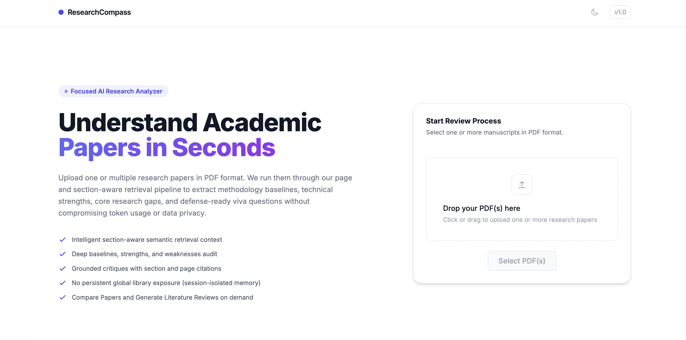
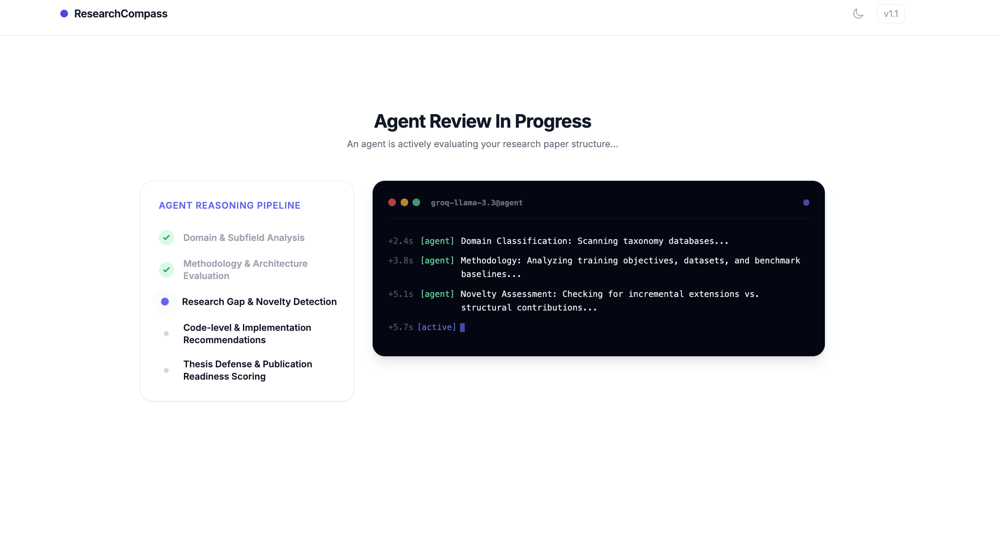
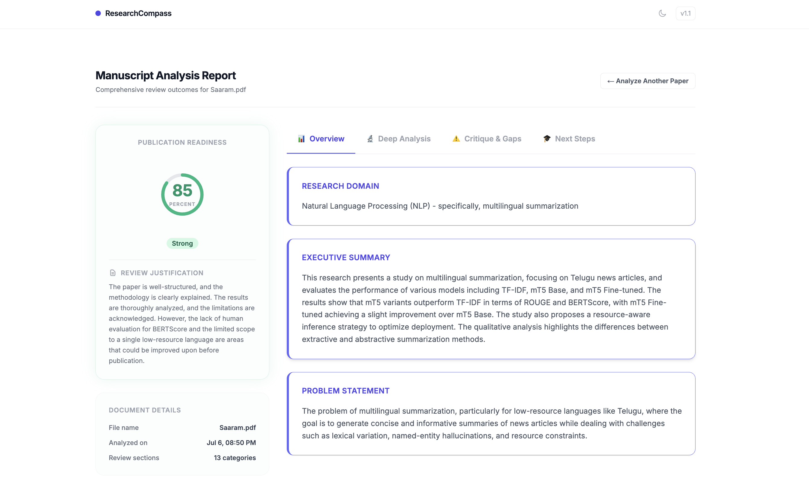
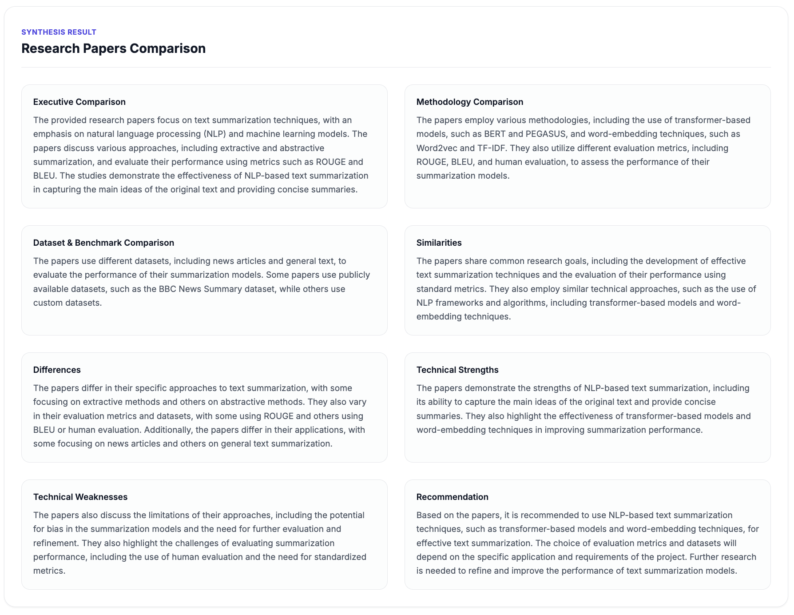
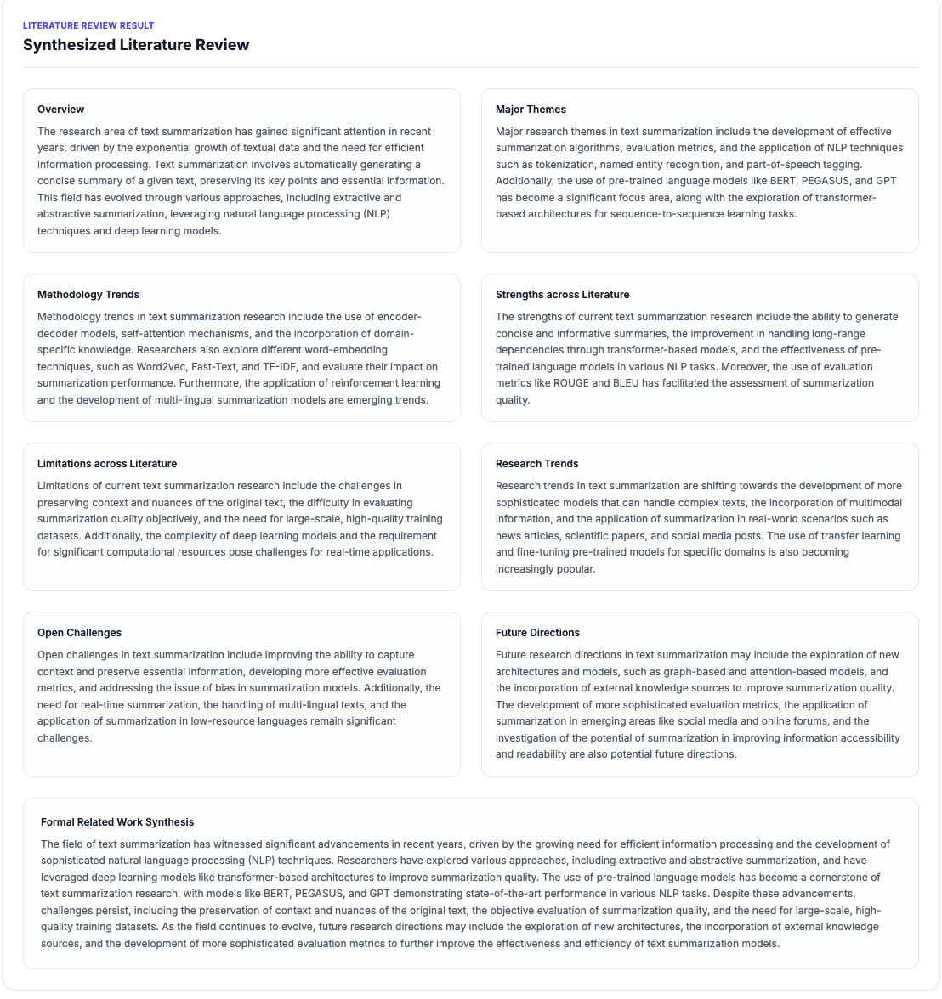

# ResearchCompass

ResearchCompass is an open-source AI research paper analyzer that extracts, retrieves, and analyzes scientific publications using Retrieval-Augmented Generation (RAG). It helps researchers understand papers, identify research gaps, compare manuscripts, and generate literature reviews.

ResearchCompass is designed as a focused, lightweight developer and research utility. It is **not** a document management platform, research workspace, Mendeley/Zotero clone, or SaaS dashboard.

[](https://fastapi.tiangolo.com)
[](https://nextjs.org)
[](https://www.trychroma.com)
[](https://groq.com)
[](LICENSE)

---

## Visual Interface Overview

The entire user journey operates in a single, cohesive flow:

### 1. Landing & Multi-PDF Upload
Select, select multiple, or drop PDF manuscripts.


### 2. Live Agent Console Pipeline
Observe real-time reasoning checklist states and console log streams during processing.


### 3. Structured Critiques Dashboard
Tab through structured analysis results, including Grounded Page Citations, Thesis Viva questions, and Readiness scorecard summaries.


### 4. Contextual Comparative Actions
Compare methodology baselines and dataset metrics across multiple files.


### 5. Synthesized Literature Reviews
Review a cohesive, theme-based related work article synthesized on demand.


---

## Features

* **AI-Powered Manuscript Analysis**: Multi-stage evaluation of academic publications covering methodology, strengths, weaknesses, novelty, and future directions.
* **Multi-PDF Session Upload**: Upload one or multiple PDFs in a single drag-and-drop landing page action.
* **Structured AI Critiques**: Outputs strict schema-validated reports including detailed thesis-defense viva questions and publication readiness scores.
* **Citation-Based Grounding**: Highlights parenthetical section and page numbers for strengths, weaknesses, gaps, and improvements (e.g. `(Page 4, Section: Methodology)`) directly derived from source document chunks.
* **Cross-Paper Comparison**: Perform contextual comparisons evaluating overlaps, dataset differences, and general comparisons across multiple active papers.
* **Synthesized Literature Reviews**: Coherently synthesize a formal "Related Work" review block from uploaded documents inside the active session.
* **Targeted Semantic Retrieval (RAG)**: Uses multi-query targeted searches across document categories to pull high-density reasoning evidence.
* **ChromaDB Integration**: Embedded local vector database used as retrieval memory for active document reasoning.

---

## Technology Stack

| Layer | Component / Technology | Role |
| :--- | :--- | :--- |
| **Frontend** | React, Next.js 15, TailwindCSS, TypeScript | User interface, file uploads, session state tracking, results view |
| **Backend** | Python, FastAPI, Pydantic | REST API, service layer orchestration, request validation |
| **AI Processing** | Groq Cloud (Default Provider) | LLM reasoning engine (defaults to `llama-3.3-70b-versatile` on Groq) |
| **Vector Database** | ChromaDB | Local vector indexing and persistent vector query matching |
| **Embeddings** | SentenceTransformers (`BAAI/bge-small-en-v1.5`) | Generates 384-dimensional dense vectors for chunks and queries |
| **Deployment** | Docker, Docker Compose | Containerized execution environment |

---

## System Architecture

```
+-------------------------------------------------------------+
|                          FRONTEND                           |
|  [page.tsx] (Uploader, Results, Contextual Actions)         |
+------------------------------+------------------------------+
                               | POST JSON/Multipart
                               v
+-------------------------------------------------------------+
|                           BACKEND                           |
|  [routes.py] (FastAPI Router Endpoint Handling)             |
|        |                                                    |
|        v                                                    |
|  [pdf_service.py] (PyMuPDF Page & Text Extractor)           |
|        |                                                    |
|        v                                                    |
|  [chunking_service.py] (Section Header Parser & Chunker)    |
|        |                                                    |
|        v                                                    |
|  [embedding_service.py] (BAAI Embedding Generation)         |
|        |                                                    |
|        v                                                    |
|  [vector_store_service.py] (ChromaDB Indexing)              |
|        |                                                    |
|        v                                                    |
|  [retrieval_service.py] (Configurable Multi-Stage RAG)      |
|        |                                                    |
|        v                                                    |
|  [analysis_service.py] (LLM Prompt Assembly & Execution)    |
+------------------------------+------------------------------+
                               | JSON Completion API
                               v
+-------------------------------------------------------------+
|                      EXTERNAL PROVIDER                      |
|  [Groq] (Default) / [OpenRouter] / [Ollama]                 |
+-------------------------------------------------------------+
```

---

## Project Structure

```text
├── backend/
│   ├── app.py                # FastAPI initialization, middleware, and route registration
│   ├── config.py             # Environment configurations, timeouts, models, and CORS
│   ├── dependencies.py       # Singleton service providers using @lru_cache dependencies
│   ├── exceptions.py         # Domain exceptions (PDF limits, password blocks, provider fails)
│   ├── models.py             # Strict Pydantic schemas for requests, responses, and collections
│   ├── routes.py             # API routes (/analyze, /compare, /literature-review, /search)
│   ├── providers/            # LLM provider classes (Groq, OpenRouter, Ollama)
│   ├── services/             # Core business logic (chunking, embedding, retrieval, vector db)
│   └── tests/                # Pytest coverage for service layers, chunkers, and prompts
├── frontend/
│   ├── app/                  # Next.js page components, layout, and global CSS
│   ├── components/           # UI elements (UploadSection, ResultsDashboard, AgentWorkflow)
│   ├── lib/                  # Fetch wrappers for API requests
│   └── types/                # TypeScript interfaces for API models
```

---

## API Endpoints

### 1. `POST /api/analyze`
* **Purpose**: Ingests an uploaded PDF, parses text, generates embeddings, indexes it in Chroma, runs section-aware targeted RAG retrieval, and computes a detailed AI critique.
* **Request**: `multipart/form-data` containing a single `file: UploadFile`.
* **Response**: A JSON object matching the `AnalysisResponse` schema:
  ```json
  {
    "research_domain": "string",
    "executive_summary": "string",
    "problem_statement": "string",
    "methodology": "string",
    "key_contributions": ["string"],
    "strengths": ["string (Page X, Section: Y)"],
    "weaknesses": ["string (Page X, Section: Y)"],
    "research_gaps": ["string (Page X, Section: Y)"],
    "novelty_assessment": "string",
    "implementation_improvements": ["string (Page X, Section: Y)"],
    "future_work": ["string"],
    "viva_questions": ["string"],
    "publication_readiness_score": 85,
    "publication_readiness_justification": "string",
    "metadata": {
      "document_id": "uuid-string"
    }
  }
  ```

### 2. `POST /api/compare`
* **Purpose**: Generates a comparative analysis evaluating overlaps, methodology constraints, and datasets across multiple documents.
* **Request**: `application/json`
  ```json
  { "document_ids": ["uuid-1", "uuid-2"] }
  ```
* **Response**: `ComparisonResponse` JSON object containing comparative metrics.

### 3. `POST /api/literature-review`
* **Purpose**: Synthesizes thematic developments, methodology trends, open limits, and compiles a formal "Related Work" academic literature review section.
* **Request**: `application/json`
  ```json
  { "document_ids": ["uuid-1", "uuid-2"] }
  ```
* **Response**: `LiteratureReviewResponse` JSON object containing structured thematic summaries and a complete `generated_literature_review` narrative.

### 4. `POST /api/search`
* **Purpose**: Vector similarity search over indexed chunks, scoped strictly to active documents.
* **Request**: `application/json`
  ```json
  { "query": "string", "top_k": 5, "document_ids": ["uuid-1", "uuid-2"] }
  ```
* **Response**: `SemanticSearchResponse` array containing matching retrieved chunk objects.

### 5. `GET /api/documents`
* **Purpose**: Returns metadata for all indexed vectors currently retained in ChromaDB.
* **Response**: `list[LibraryDocument]` JSON array. (Hidden in UI to protect multi-user session privacy, but functional).

---

## AI Ingestion & Retrieval Strategy (RAG)

ResearchCompass implements an advanced **Retrieval-Augmented Generation (RAG)** pipeline to maximize LLM reasoning accuracy while preserving latency and token limits:

1. **PDF Ingestion & Metadata Parsing**: Extracted text pages retain bounding coordinates, original author headers, creation dates, and exact page numbers using PyMuPDF.
2. **Section-Aware Chunking**: The chunker segments pages into paragraphs, detecting structural markdown sections (e.g., Abstract, Methodology, Experiments, Conclusions) using regex heuristics.
3. **Dense Indexing**: Chunks are embedded using `BAAI/bge-small-en-v1.5` and committed to ChromaDB under user-independent, session-scoped logical boundaries.
4. **Targeted Sub-Querying**: 
   Rather than dumping the entire raw text (which bloats context windows and induces LLM "loss in the middle" hallucination) or querying Chroma with a single broad keyword phrase, the system executes **four targeted sub-queries**:
   * *Overview*: Queries abstract and problem introduction boundaries.
   * *Methodology*: Queries architectures, layers, training procedures, and databases.
   * *Evaluation*: Queries datasets, benchmarks, results, and baselines.
   * *Conclusion*: Queries contributions, weaknesses, future work, and thesis questions.
5. **Context Aggregation**: Retrieved chunks are merged, de-duplicated by `chunk_id`, and sorted chronologically matching the document's original sequence.
6. **Structured JSON Completion**: The context is fed alongside a systemic prompt to the LLM (e.g. Groq Cloud `llama-3.3-70b-versatile`) with strict JSON completion formatting, generating evidence-grounded reports.

### Why the Targeted Retrieval Strategy Exists

Instead of feeding the language model a massive context dump of the entire research paper, ResearchCompass applies a targeted retrieval model:
* **Diverse Context Capture**: Using multiple focused semantic queries ensures we pull relevant evidence from distinct parts of the paper (e.g., methodology separately from experimental limitations).
* **Mitigating "Lost in the Middle"**: LLMs tend to miss details nested in the middle of long text blocks. Shorter, highly relevant chunks keep context dense and clear.
* **Grounded Citations**: Grounding critiques directly inside narrow retrieved chunks allows the LLM to output accurate page and section citations without fabricating them.
* **Token and Latency Efficiency**: Sending only the most relevant sections stays well within context limits and reduces network transfer sizes, keeping execution fast.

---

## ChromaDB Storage

ChromaDB acts as the application's retrieval memory:
* **Persistence**: Vector embeddings are persisted locally on disk inside the SQLite-backed `./chroma` folder.
* **Session boundaries**: Frontend active document tracking scopes analysis, comparison, search, and literature reviews strictly to the current browser tab session using list arrays of document IDs.
* **Isolation**: Version 1.0 does not implement authenticated user-isolated collections at the database layer.

---

## Provider Support

The system uses a flexible provider abstraction to manage language model invocations:
* **Default Setup**: Groq is the default provider due to its low latency and native JSON completion support.
* **Abstraction Support**: Integrations for OpenRouter and local Ollama deployments are fully implemented, allowing users to swap providers via environment variable configurations.
* **Planned Configuration**: Automatic rate-limit provider fallback routing is planned for a future release.

---

## Current Limitations & Engineering Trade-offs

* **Local Persistent Store**: ChromaDB embeddings persist on disk and the database grows continuously unless cleared manually.
* **No Database Authentication**: There are no logins or authenticated user accounts; document boundaries are logically constrained at the API query level.
* **No Automatic Pruning**: Old session collections are not automatically deleted.
* **No Streaming Responses**: Client requests wait for the full Pydantic JSON structure to complete before returning results.
* **Automatic Fallback Not Yet Implemented**: The LLM provider abstraction requires manually restarting the backend configuration if changing hosts.

---

## Roadmap

### Version 1.1 (Incremental Refinements)
* **Interactive In-File Search**: Add a search interface within the document dashboard to query specific lines of the active paper.
* **Export PDF/Markdown**: Export structured reviews, comparative matrix cards, and synthesized related work articles directly.

### Version 2.0 (Enterprise Collaboration)
* **User Authentication**: OAuth2 boundaries and user sign-in flows.
* **Isolated Multi-Tenant Collections**: Generate user-scoped Chroma DB collection keys (e.g., `user_{id}`) on the database layer.
* **Reference Manager Sync**: Directly import and sync files using Zotero and Mendeley web API endpoints.

---

## Local Setup

### Prerequisites
* Python 3.10 or 3.11
* Node.js 18+

### Backend Setup
1. Move to backend, configure environment, and start server:
   ```bash
   cd backend
   python -m venv venv
   source venv/bin/activate
   pip install -r requirements.txt
   cp .env.example .env
   ```
2. Set your credentials (e.g. `GROQ_API_KEY`) in `backend/.env`.
3. Launch:
   ```bash
   uvicorn app:app --reload --port 8000
   ```

### Frontend Setup
1. Install dependencies and start local dev server:
   ```bash
   cd frontend
   npm install
   npm run dev
   ```
2. Open [http://localhost:3000](http://localhost:3000).

---

## Running with Docker

Docker configurations are fully implemented for both backend and frontend layers:
1. Copy environments:
   ```bash
   cp backend/.env.example backend/.env
   ```
2. Start the containerized services:
   ```bash
   docker compose up --build
   ```
3. Access the frontend app at [http://localhost:3000](http://localhost:3000) and backend at [http://localhost:8000](http://localhost:8000).

---

# Contributing

ResearchCompass is an open-source project and community contributions are always welcome. Whether you are fixing bugs, updating documentation, refining prompts, or adding new model providers, your help makes ResearchCompass more robust and accessible.

### Ways to Contribute
* **Fix Bugs**: Identify and resolve edge-case errors or parsing crashes.
* **Improve Documentation**: Correct typos, write setup instructions, or document new workflows.
* **Refine UI/UX**: Polish layouts, dark-mode styling, or tab interactions.
* **Improve Retrieval Quality**: Tweak targeted RAG queries to fetch more representative contexts.
* **Prompt Engineering**: Refine system prompts for more accurate thesis viva questions and score validations.
* **Increase Test Coverage**: Add backend unit tests inside `backend/tests/` to protect core services.
* **LLM Providers**: Add new hosted APIs (e.g. Anthropic, Cohere, OpenAI) to the provider factory.
* **Deployment**: Optimize Docker images or local Compose orchestrations.

### Good First Issues
If you are contributing to ResearchCompass for the first time, these beginner-friendly issues are a great starting point:
* **Improve Error Handling**: Gracefully catch network or parsing errors on the client and show helpful notifications.
* **Refine Loading States**: Improve loading indicators to feel smoother.
* **Accessibility (a11y)**: Audit HTML tags to ensure compatibility with screen readers.
* **Responsive Layouts**: Polish results tabs so they wrap nicely on mobile screens.
* **Logging**: Add structural logging inside service layers for easier local debugging.
* **Optimizing Prompts**: Polish the LLM wording for clearer justifications.

### Community Guidelines
* Please open an issue to discuss major changes before submitting a pull request.
* Keep pull requests focused on a single change to make review quick and simple.
* Include tests when possible and update documentation alongside code changes.
* Follow the existing architecture patterns and coding style in the repository.

---

# Support

If you discover a bug, please open a GitHub Issue.

If you have an idea, feedback, or feature request, we'd love to hear from you.

---

## License

Distributed under the MIT License. See [LICENSE](LICENSE) for details.
