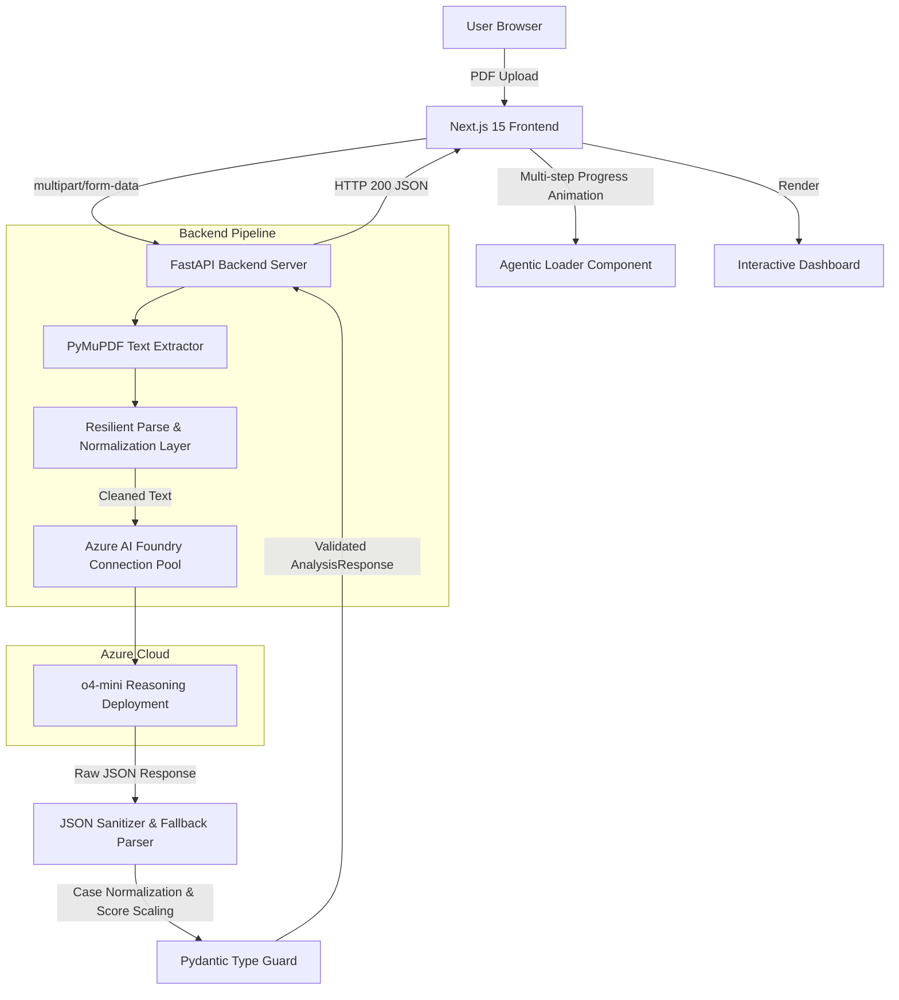

# ResearchCompass

> **An autonomous research reasoning agent evaluating academic papers and detecting gaps using Microsoft Azure AI Foundry.**

---

[](https://fastapi.tiangolo.com)
[](https://nextjs.org)
[](https://azure.microsoft.com/en-us/products/ai-foundry)
[](LICENSE)

---

## 📌 Elevator Pitch
ResearchCompass is an autonomous research reasoning agent that critiques academic research papers, identifies hidden methodology flaws and research gaps, and scores publication readiness—powered by the advanced reasoning layers of Microsoft Azure AI Foundry.

---

## ⚡ Problem Statement
Academic peer review is a high-friction process: it is slow, often subjective, and inaccessible to students before submission. Researchers frequently struggle to:
- Identify unaddressed limitations and methodology holes in their own draft papers.
- Benchmark their contributions against existing baselines.
- Generate tough thesis/viva questions to prepare for defense.
- Objectively gauge if their work is ready for publication in top-tier conferences or journals.

---

## 💡 Solution Overview
ResearchCompass acts as a self-hosted, autonomous **Research Advisor Agent**. Rather than performing simple document summarization, the agent conducts a critical peer review. 

By extracting text from uploaded PDFs and feeding it into a multi-step reasoning pipeline hosted on **Microsoft Azure AI Foundry (o4-mini)**, the agent delivers a comprehensive evaluation dashboard. This includes concrete code-level improvements, detailed gap detections, viva defense questions, and a normalized publication readiness score.

---

## 🛠️ Architecture Overview
ResearchCompass is designed with a decoupled frontend-backend architecture structured to maximize response resiliency and safety:



### Data Flow
1. **Extraction Layer**: PyMuPDF (`fitz`) opens the PDF stream inside a memory-safe context manager, extracting structured text.
2. **Reasoning Agent**: The FastAPI server routes requests to a connection-pooled **OpenAI client** pointing directly to the **Azure AI Foundry** endpoint.
3. **Resilient Parsing**: A custom parsing layer cleans markdown block formats (````json ... ````), normalizes camelCase/dashed fields, and normalizes rating scales (scaling 1-10 scores to 0-100%).
4. **Pydantic Validation**: Ensures response payloads conform strictly to the typescript type contract before returning data to the UI.

---

## 🤖 Agent Workflow Section
During computation, the **o4-mini reasoning model** runs an internal chain-of-thought process executing 6 distinct logical steps:

| Step | Phase | Focus |
| :--- | :--- | :--- |
| `1` | **Domain Analysis** | Identifies the precise computer science domain and subfield categorization. |
| `2` | **Methodology Review** | Critiques models, datasets, baseline comparison accuracy, and metrics. |
| `3` | **Research Gap Detection** | Finds what was omitted, oversimplified, or ignored in the paper. |
| `4` | **Improvement Recommendations** | Suggests concrete, actionable code-level edits and parameter scaling. |
| `5` | **Viva Questions** | Generates 5 defense questions typical of a PhD thesis committee. |
| `6` | **Publication Evaluation** | Computes a readiness score from 0-100 and outlines justifying reasoning. |

---

## 🎨 User Experience & Demo Quality
ResearchCompass features a modern **glassmorphic design system** supporting complete Dark/Light modes. 

### Visual Pipeline Loading
While the LLM processes the paper, the frontend displays a real-time progress timeline of the agent's reasoning chain, preventing the application from feeling static:

```text
  [✓] Domain & Subfield Analysis
  [✓] Methodology & Architecture Evaluation
  [●] Research Gap & Novelty Detection  <-- (Active Pulsing Indicator)
  [ ] Code-level & Implementation Recommendations
  [ ] Thesis Defense & Publication Readiness Scoring
```

---

## 🖼️ Screenshots Placeholders

### 1. File Upload Dropzone

*Figure 1: Clean dropzone supporting drag-and-drop PDF upload and live reasoning pipeline visualization.*

### 2. Analysis Dashboard

*Figure 2: Unified dashboard rendering domain categorization, executive summary, methodology breakdown, and color-coded strengths/weaknesses.*

### 3. Publication Score Card

*Figure 3: Graphical scorecard rendering normalized readiness percentage and peer-review justification.*

---

## 🚀 Microsoft Integration & Agents League Highlight

### Microsoft Azure AI Foundry
ResearchCompass uses **Azure AI Foundry** to deploy and run **o4-mini**. Because academic reviews require logical deduction rather than basic pattern matching, utilizing a reasoning model with an internal reasoning trace is crucial. 

### GitHub Copilot Story
This project was polished and hardened using **GitHub Copilot Workspace** and **Antigravity**. Copilot accelerated development by:
- Writing the regex-based JSON block extractor to parse LLM outputs.
- Generating unit tests for key-casing normalization.
- Providing CSS utilities to animate the frontend loading states.

---

## 📦 Technology Stack
- **Frontend**: Next.js 15, React 18, TypeScript, Tailwind CSS
- **Backend**: FastAPI (Python 3.11), PyMuPDF (`fitz`), Pydantic v2
- **AI Platform**: Microsoft Azure AI Foundry (o4-mini)

---

## ⚙️ Environment Variables

### Backend (`backend/.env`)
```env
AZURE_OPENAI_ENDPOINT=https://<your-resource-name>.services.ai.azure.com/openai/v1/
AZURE_OPENAI_API_KEY=your_azure_openai_api_key_here
AZURE_OPENAI_DEPLOYMENT=o4-mini
```

### Frontend (`frontend/.env`)
```env
NEXT_PUBLIC_API_URL=http://localhost:8000
```

---

## 🚀 Installation & Setup

### Backend Prerequisites
Ensure you have Python 3.11+ installed.

1. Navigate to the backend directory:
   ```bash
   cd backend
   ```
2. Initialize virtual environment and install packages:
   ```bash
   python -m venv venv
   source venv/bin/activate  # Windows: venv\Scripts\activate
   pip install -r requirements.txt
   ```
3. Set up variables:
   ```bash
   cp .env.example .env
   # Edit backend/.env and populate with Azure endpoint and API keys
   ```
4. Start the server:
   ```bash
   uvicorn app:app --reload --port 8000
   ```

### Frontend Prerequisites
Ensure you have Node.js 18+ and npm installed.

1. Navigate to the frontend directory:
   ```bash
   cd frontend
   ```
2. Install dependencies:
   ```bash
   npm install
   ```
3. Set up environment:
   ```bash
   cp .env.example .env
   ```
4. Run in development mode:
   ```bash
   npm run dev
   ```
5. Open your browser and navigate to `http://localhost:3000`.

---

## 🔮 Future Improvements (Roadmap)
- **FAISS Vector Indexing**: Retrieve and embed abstracts of topically matching papers from arXiv to ground gap detection in active prior art.
- **Crossref Citation Graphing**: Extract references section, match DOIs, and build a citation network to identify missing seminal papers.
- **Batch Paper Comparison**: Upload multiple PDFs to align methodologies and datasets across comparable papers.

---

## 📄 License
This project is licensed under the MIT License. See [LICENSE](LICENSE) for details.
